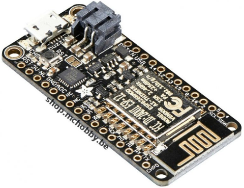

# Les Objets Internet ESP8266

Le projet utilise des [Feather ESP8266](https://shop.mchobby.be/feather/846-feather-huzzah-avec-esp8266-3232100008465-adafruit.html) reflashés avec MicroPython (Python pour MicroContrôleur). 

Cette section du GitHub contient 4 sous-répertoires principaux, un par objet __incluant schéma et code__:
* __cabane__ : utilisant un [AM2315](https://shop.mchobby.be/senseur-divers/932-am2315-senseur-de-temperature-et-humidite-sous-boitier-3232100009325.html) (température humidité), [BMP280](https://shop.mchobby.be/senseurs-prototypage/1118-bmp280-senseur-de-pression-barometrique-temperature-altitude-33-et-5v-3232100011182-adafruit.html) (pression température), [TSL2561](https://shop.mchobby.be/senseur-divers/238-senseur-lux-luminosite-lumiere-digital-3232100002388-adafruit.html) (luminosité) 
* __chaufferie__ : [module relais](https://shop.mchobby.be/breakout/507-module-deux-relais-3232100005075-pololu.html) et [DS18B20](https://shop.mchobby.be/senseur-divers/151-senseur-temperature-ds18b20-etanche-extra-3232100001510.html) (température 1-Wire)
* __salon__ : [ADS1115](https://shop.mchobby.be/breakout/362-ads1115-convertisseur-adc-16bits-i2c-3232100003620-adafruit.html) (convertisseur ADC), [TMP36](https://shop.mchobby.be/senseur-divers/59-senseur-temperature-tmp36-3232100000599.html) (température)
* __veranda__ : [ADS1115](https://shop.mchobby.be/breakout/362-ads1115-convertisseur-adc-16bits-i2c-3232100003620-adafruit.html) (convertisseur ADC), [TMP36](https://shop.mchobby.be/senseur-divers/59-senseur-temperature-tmp36-3232100000599.html) (température), [Photo-Résistance](https://shop.mchobby.be/senseur-divers/58-photo-resistance-3232100000582.html) (lumière), [Switch Magnétique](https://shop.mchobby.be/proximite/60-contact-magnetique-compact-3232100000605.html)

D'autres sous-répertoires contiennent des ressources complémentaires:
* __boot__ : contient différents scripts de boot.py pour couvrir le démarrage de l'ESP8266 et connexion sur le réseau WiFi
* __divers__ : différents exemples dont souscription et publication MQTT, utilisation de scheduler ASyncIO sous MicroPython 

# Ressources MicroPython pour ESP8266

MC Hobby consacre une partie de son Wiki à l'utilisation de MicroPython sur ESP8266
* voir (ESP8266 en MicroPython](https://wiki.mchobby.be/index.php?title=MicroPython-Accueil#ESP8266_en_MicroPython)

Le GitHub uPy-ESP8266 contient des exemples et pilotes MicroPython à utiliser avec ESP8266 et autres plateforme MicroPython.
* Voir [GitHub uPy-ESP8266](https://github.com/mchobby/esp8266-upy) 

