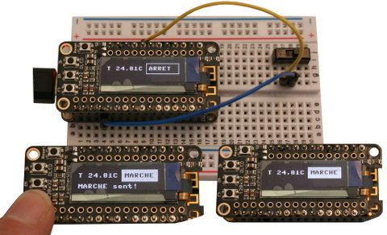

# Chaufferie OLED

Cet objet à base d'ESP8266 et écran OLED I2C permet de commander
la chaufferie depuis un module indépendant et de suivre l'évolution
de la température.

Le bloc SWITCH supportant maintenant la souscription MQTT en Javascript, le
changement d'état initié avec cet objet est visible dans l'interface WEB et
vice-versa.

# Schéma

Le schéma en [haute résolution est disponible ici](schema.png).

A noter aussi qu'il y a des [subtilités de fonctionnant d'un ESP8266 et OLED I2C](feather_SSD1306_128x32.png).

# Code MicroPython

Voir le fichier [main.py](main.py) pour le code à copier sur l'ESP MicroPython.
