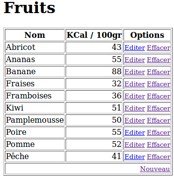
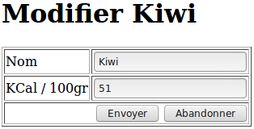

# Mini-Projet Fruits
Fruits est un Mini-projet visant à démontrer la mise en œuvre d'une base de données SQLite 3 dans un projet Flask.

Pour que la démonstration soit satisfaisante, l'exemple va au-delà de la simple connexion SQLite en proposant quelques fonctionnalités de bases comme lister le contenu d'une table de fruits et proposer la modification d'enregistrements. 

Il mettra donc en œuvre la connexion SQLite, les routes, édition de form HTML (GET et POST), des templates Jinja.

_Le but du mini-projet est d'offrir un maximum de fonctionnalités avec un minimum de complexité.  

A l'exception de CSS (esthétisme) et de WTF (saisie et validation de Form HTML), cet exemple est ce qui se rapproche le plus d'une vraie application Flask.

